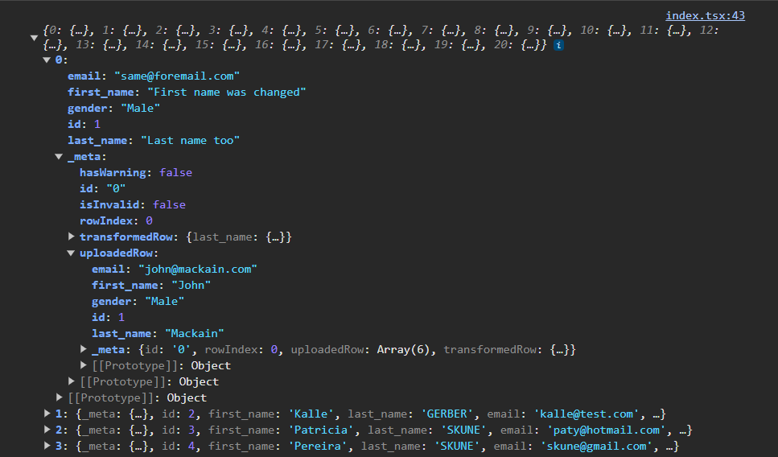

It's possible to track the uploaded records, having a way to retrieve the initial data, in the state it was before any changes to your spreadsheet.

A boolean property called `trackUploadedRecords` can be passed to the [Importer options](/getting-started/embedding#launching-an-importer).\
**This is disabled by default.**

```js
// set these from your Fuse account
const organizationApiKey = "YOUR ORGANIZATIONS API KEY";
const importerId = "YOUR IMPORTER ID";

const importerOptions = {
  trackUploadedRecords: true // whether or not to store the uploaded records
};

const importer = new FuseImporter(organizationApiKey, importerId, importerOptions);
```

This stores the uploaded record inside the `_meta` property from your records.



