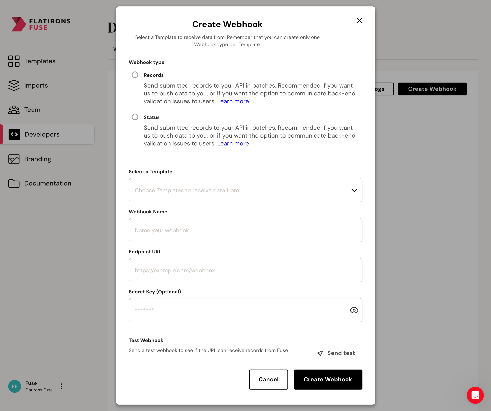

When creating webhooks, you have the option to provide a secret key for added security. This secret key is used to generate a signature for each outgoing payload. To ensure the integrity of incoming webhook payloads, you can validate the signature on your server.



To add a Webhook, go to the [Developers tab](https://fuse.flatirons.com/account/developers) of your Fuse account.

## Providing a Secret Key

When creating or configuring a webhook, include a secret key in the webhook settings. This key is a shared secret between our server and the recipient of the webhook.

## Signature Generation

The signature is generated using the HMAC (Hash-based Message Authentication Code) algorithm with SHA-256. The process involves creating a hexdigest using the secret key and the raw payload of the webhook.

## Signature Verification

To validate the incoming webhook payload, you need to generate the signature on your end using the same process and compare it with the signature provided in the incoming request.

### Signature Validation Code

Below are code snippets in various programming languages to help you validate webhook signatures:

<Tabs>

  <Tab title="Node.js (Nest.js / Express.js)">
  ```typescript
    import * as crypto from 'crypto';

    function validateSignature(secretKey: string, rawPayload: string, receivedSignature: string): boolean {
      const expectedSignature = crypto.createHmac('sha256', secretKey).update(rawPayload).digest('hex');
      return receivedSignature === expectedSignature;
    }

  ```
  </Tab>
  <Tab title="Ruby">

  ```ruby

  require 'openssl'

  def validate_signature(secret_key, raw_payload, received_signature)
    expected_signature = OpenSSL::HMAC.hexdigest(
      OpenSSL::Digest.new('sha256'),
      secret_key,
      raw_payload
    )
    received_signature == expected_signature
  end

  ```
  </Tab>
  <Tab title="PHP (Laravel)">

  ```php
  use Illuminate\Support\Facades\Request;
  use Illuminate\Support\Facades\Hash;

  function validateSignature($secretKey, $rawPayload, $receivedSignature) {
    $expectedSignature = Hash::hmac('sha256', $rawPayload, $secretKey);
    return hash_equals($expectedSignature, $receivedSignature);
  }

  ```
  </Tab>
  <Tab title="Python">

  ```python
  import hashlib
  import hmac

  def validate_signature(secret_key, raw_payload, received_signature):
      expected_signature = hmac.new(secret_key.encode('utf-8'), raw_payload.encode('utf-8'), hashlib.sha256).hexdigest()
      return received_signature == expected_signature

  ```
  </Tab>
  <Tab title="Java (Spring boot)">
  ```java
      import javax.crypto.Mac;
      import javax.crypto.spec.SecretKeySpec;
      import java.security.InvalidKeyException;
      import java.security.NoSuchAlgorithmException;

      public class WebhookValidator {

          public static boolean validateSignature(String secretKey, String rawPayload, String receivedSignature) {
              try {
                  Mac hmac = Mac.getInstance("HmacSHA256");
                  SecretKeySpec secretKey = new SecretKeySpec(secretKey.getBytes(), "HmacSHA256");
                  hmac.init(secretKey);

                  byte[] hashBytes = hmac.doFinal(rawPayload.getBytes());
                  String expectedSignature = bytesToHex(hashBytes);

                  return receivedSignature.equals(expectedSignature);
              } catch (NoSuchAlgorithmException | InvalidKeyException e) {
                  e.printStackTrace(); // Handle the exception according to your needs
                  return false;
              }
          }

          private static String bytesToHex(byte[] bytes) {
              StringBuilder hexStringBuilder = new StringBuilder();
              for (byte b : bytes) {
                  hexStringBuilder.append(String.format("%02x", b));
              }
              return hexStringBuilder.toString();
          }
      }
  ```
  </Tab>
  <Tab title="C#">

  ```cs
  using System.Security.Cryptography;
  using System.Text;

  public class WebhookValidator
  {
      public static bool ValidateSignature(string secretKey, string rawPayload, string receivedSignature)
      {
          using (var hmac = new HMACSHA256(Encoding.UTF8.GetBytes(secretKey)))
          {
              var expectedSignature = BitConverter.ToString(hmac.ComputeHash(Encoding.UTF8.GetBytes(rawPayload))).Replace("-", "").ToLower();
              return receivedSignature == expectedSignature;
          }
      }
  }

  ```
  </Tab>
</Tabs>

Remember to replace secretKey, rawPayload, and receivedSignature with the actual values from your webhook payload and headers. Incorporate these functions into your webhook endpoint to verify incoming requests.
