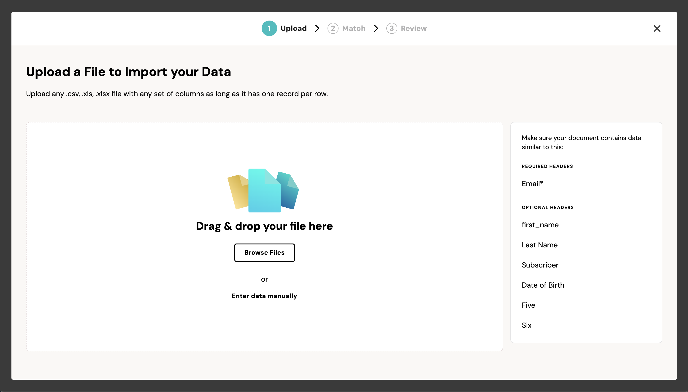

Fuse has built-in support for launching the importer within a modal. Simply pass the `modal: true` option when you instantiate your importer.

```javascript
const importerOptions = {
  modal: true 
};

const importer = new FuseImporter({ options: importerOptions });

// This method should call your backend to get a importer session token
// For more details, refer to the documentation: https://fuse-docs.flatirons.com/getting-started/embedding#launching-an-importer
importer.getSessionToken = async () => {
  // return a session token
};

importer.show();
```


